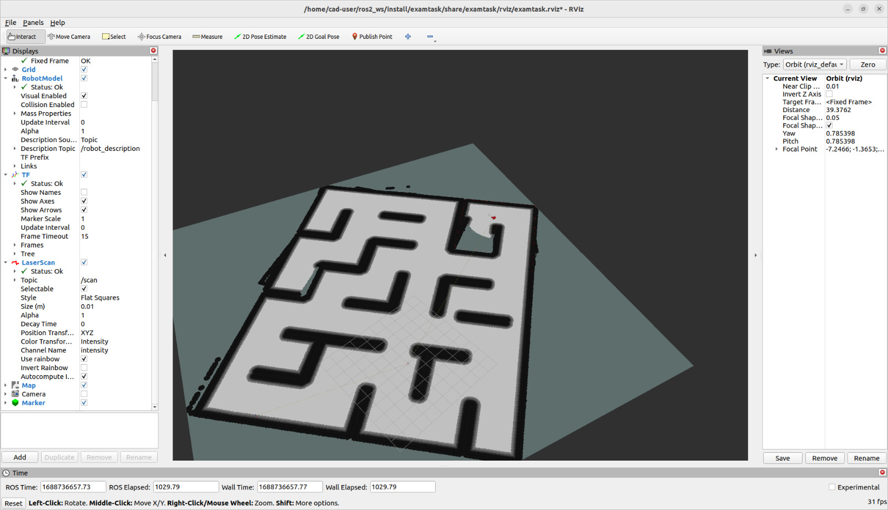
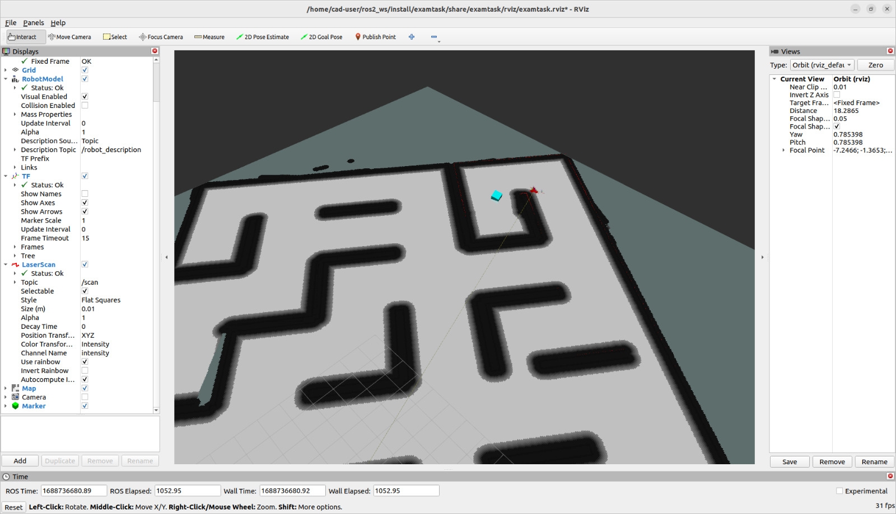

# Mobile Robotics – ROS 2 Examination Task
This ROS 2 package was developed as part of the **Mobile Robotics Examination Task** during my Master’s program. It includes a complete differential-drive robot setup in Gazebo, integrated with RViz, mapping, and a Python script for yellow-object detection.

## Task Images
## Mapping Example Image




## Package Overview
**Included in the package:**
- `package.xml` and `CMakeLists.txt` (ROS 2 build system files)
- URDF for a **differential-drive robot** (no external meshes; fully compatible with Gazebo)
- Gazebo **world file** with movable walls
- Controller configuration for the **differential-drive controller**
- **Launch files** for Gazebo and RViz
- **RViz configuration** for visualization
- **Map folder** containing a pre-saved world map
- **Meshes folder** with all required STL and 3D model files
- **Script folder** containing the **Yellow Object Detection** Python node

## Dependencies and Setup
### Required ROS 2 Distribution
Tested on **ROS 2 Humble**.  
Install the following dependencies before running:

```bash
sudo apt install python3-rosdep python3-colcon-common-extensions python3-argcomplete
sudo apt install ros-$ROS_DISTRO-cv-bridge
sudo apt install python3-opencv python3-numpy
sudo rosdep init
sudo apt install ros-humble-tf2-ros ros-humble-tf2-geometry-msgs
sudo apt install gnome-terminal
```

`gnome-terminal` is required if you plan to run the provided `examscript.sh`.

### Environment Variables
Add the following lines to your **~/.bashrc** before running the project:

```bash
source /opt/ros/humble/setup.bash
source /usr/share/colcon_argcomplete/hook/colcon-argcomplete.bash
source ~/ros2_ws/install/setup.bash
source ~/ros2_ws/install/local_setup.bash
export GAZEBO_MODEL_PATH=~/ros2_ws/src/examtask/meshes
export RMW_IMPLEMENTATION=rmw_cyclonedds_cpp
```

Then reload:
```bash
source ~/.bashrc
```

## Explore Lite (Autonomous Exploration)
This project supports integration with **Explore Lite** for autonomous exploration.

Clone the package:
```bash
cd ~/ros2_ws/src
git clone https://github.com/robo-friends/m-explore-ros2.git
```

Modify `params.yaml`:
```yaml
min_frontier_size: 0.6
```

## Yellow Object Detection
The Python node `Yellowobject.py` detects yellow objects using OpenCV and publishes a marker in RViz.  
It uses `cv_bridge` and `sensor_msgs/Image` topics.

## Running the Project
1. Ensure environment variables are sourced (`source ~/.bashrc`).
2. Build workspace:
   ```bash
   cd ~/ros2_ws
   colcon build --symlink-install
   ```
3. Source setup:
   ```bash
   source install/setup.bash
   ```
4. Run using the provided script:
   ```bash
   ./examscript.sh
   ```
   This launches Gazebo, RViz, and the robot nodes automatically.

## Folder Structure
```
ROS-Mini-Project/
├── CMakeLists.txt
├── package.xml
├── launch/
│   ├── examtask_launch.py
│   └── gazebo_rviz.launch.py
├── urdf/
│   ├── examtask.urdf
│   └── examtask.urdf.xacro
├── config/
│   ├── diff_drive_controller.yaml
│   ├── rviz_config.rviz
│   └── twist_mux.yaml
├── Map/
│   └── map.yaml
├── worlds/
│   └── smazed2.world
├── meshes/
│   ├── wall.stl
│   ├── floor.stl
│   └── other_models...
├── scripts/
│   └── Yellowobject.py
└── examscript.sh
```

## Notes
- All required packages from the course practice PDF were preinstalled on the test PC.
- Ensure all STL and 3D model files are correctly placed in the `meshes` folder before launching Gazebo.
- The system supports mapping and autonomous exploration using Explore Lite.
- Tested successfully in the Mobile Robotics examination environment.

## Credits
Developed by **Deepak Madhu**  
University of Applied Sciences Emden/Leer  
**Grade Achieved:** 1.0 (Sehr gut)

## License
This project is shared for educational and portfolio purposes.  
You are free to use or modify it for learning and demonstration.
